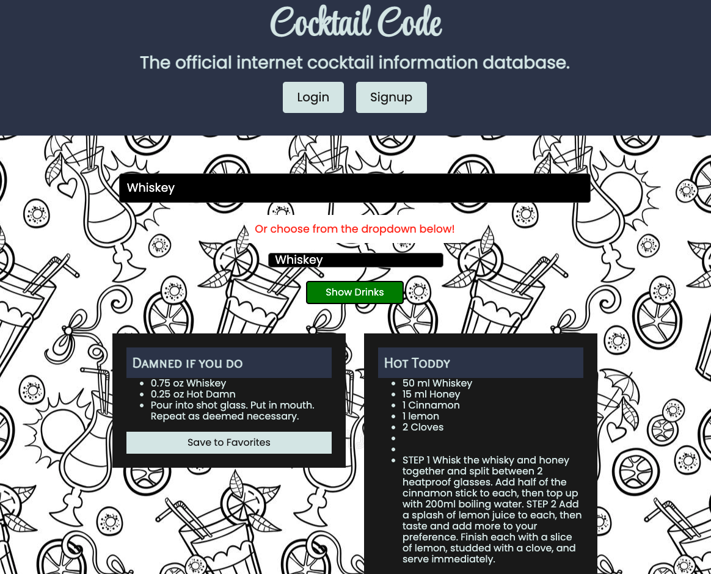

# Cocktail Code  

# Table of Contents

- [Description](#description)
- [Usage](#usage)
- [Contributing](#contributing)
- [Issues](#issues)
- [License](#license)
- [Refereces](#references)
- [Contributors](#contributors)

## Description:
This app was built using the MERN stack with a React front end, MongoDB database, and Node.js/Express.js server and a GraphQL API built with Apollo Server. 

[Link to Deployed App](https://the-cocktail-code-app.herokuapp.com/)

## Usage:
We wanted to make an app that gave mixologists, bartenders, and cocktail lovers everywhere access to hundreds of fun and unique drink recipes so that they can try new drinks and impress imbibing patrons my making any drink they could ever be requested.  

With Cocktail Code the user can also save any drink from our database into their favorites for quick and easy reference and from any device with just their log in credentials.

## Contributing:
Contributions welcomed! Please submit a pull request.  For large changes please email me first.

## Issues:
-  User favorited drinks not rendering in 'View My Profile' page.

## License:
For more information about the License, click on the link below.

## References:
-  https://reactjs.org/docs/getting-started.html
-  https://react-bootstrap.github.io/getting-started/introduction
-  https://www.apollographql.com/docs/react/
-  https://www.thecocktaildb.com/api.php

##  Contributors:
For questions about the app you can our 
Github pages at the following links

- [Alan Balcom](https://github.com/abalcs)
- [Patrick Sullivan](https://github.com/shabobble)
- [Paul Marceau](https://github.com/pmarceaujr)
- [Tracy Angell](https://github.com/tracye1083)
